# AI Document Management System
### Intelligent RAG-Powered Document Q&A with Role-Based Access

An enterprise-style AI Document Management System that allows organizations to securely store internal documents and query them using a Retrieval-Augmented Generation (RAG) pipeline powered by HuggingFace models and ChromaDB.

The system enforces **role-based access control (Admin / Staff / User)** ensuring users only retrieve information from documents they are authorized to access.

---

## How It Works (Architecture)

```
Document Upload
      ↓
Text Chunking
      ↓
Embedding Generation
      ↓
ChromaDB Vector Storage
      ↓
User Question
      ↓
Permission Filtering (RBAC)
      ↓
Relevant Context Retrieval
      ↓
HuggingFace LLM
      ↓
Grounded AI Answer
```

This prevents hallucination and ensures answers come only from allowed documents.

---

## Features

### Security & Access Control
- JWT Authentication
- Role Based Access Control (Admin / Staff / User)
- Document visibility levels
- Restricted retrieval based on permission
- Secure password hashing

### Document Management
- Upload documents
- Delete documents
- List accessible documents
- Role-restricted viewing

### AI Chat (RAG)
- Context-aware answers from documents
- Multi-session chat history
- Grounded responses (no blind LLM answers)
- HuggingFace model integration

### Admin Controls
- Create staff/admin accounts
- View all users
- Delete users
- Monitor chat sessions

### Frontend
- Streamlit based UI
- Login system
- Chat interface
- Document upload panel

---

## Tech Stack

**Backend**
- FastAPI
- SQLAlchemy
- JWT Authentication

**AI / RAG**
- ChromaDB (Vector Database)
- HuggingFace Inference API
- Embedding Retrieval Pipeline

**Frontend**
- Streamlit

---

##  Project Structure

```
app/
├── api/            # API endpoints
├── core/           # config & security
├── db/             # database setup
├── models/         # database models
├── schemas/        # request/response schemas
├── services/       # business logic
├── rag/            # RAG pipeline
│   ├── ingestion.py
│   ├── retrieval.py
│   └── vector_store.py

main.py
streamlit_frontend.py
requirements.txt
.env.example
```

---

##  Setup Guide

### Clone Repository
```bash
git clone https://github.com/sayansa123/rag-document-management-system.git
cd rag-document-management-system
```

### Create Environment Variables
```bash
cp .env.example .env
```
Fill the values inside `.env`

### Install Dependencies
```bash
pip install -r requirements.txt
```

### Run Backend
```bash
uvicorn main:app --reload
```
Backend runs at:
```
http://localhost:8000
```

### Run Frontend
```bash
streamlit run streamlit_frontend.py
```
Frontend runs at:
```
http://localhost:8501
```

---

##  Roles

| Role | Permissions |
|----|----|
| **Admin** | Full access (users + documents + chats) |
| **Staff** | Upload & query internal documents |
| **User** | Query public documents only |

---

##  Security Model

The system prevents data leakage using **retrieval-time authorization filtering**:

1. User logs in → JWT issued
2. Query received → role identified
3. Only allowed documents retrieved
4. LLM receives filtered context only

So the model **cannot answer from restricted documents**.

---

## Example Use Cases
- Company knowledge base assistant
- Internal policy Q&A bot
- Research paper search assistant
- Secure enterprise chatbot

---

## Future Improvements
- PDF preview
- OCR support
- Multi-tenant organizations
- Fine-tuned local LLM
- Docker deployment
- Per-chat memory persistence (context retention for each session)
- Strong password hashing & security hardening

---
## Snapshots

### Authentication

<p align="center">
  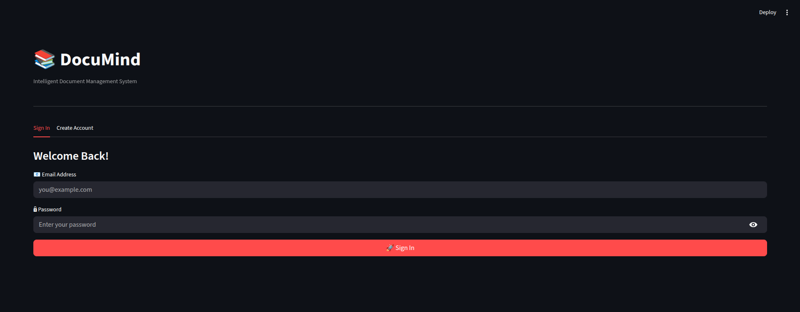
  &nbsp;&nbsp;
  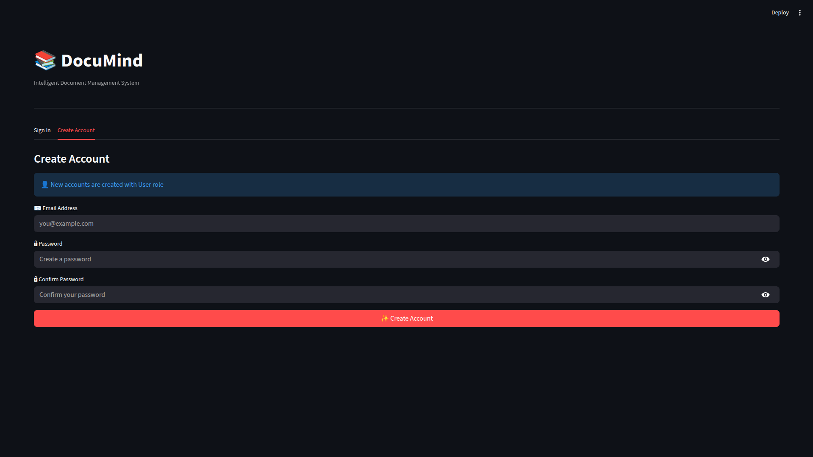
</p>
<p align="center"><em>Login &nbsp;&nbsp;&nbsp;&nbsp;&nbsp;&nbsp;&nbsp;&nbsp;&nbsp;&nbsp;&nbsp;&nbsp;&nbsp;&nbsp;&nbsp;&nbsp;&nbsp;&nbsp;&nbsp;&nbsp;&nbsp;&nbsp;&nbsp;&nbsp;&nbsp;&nbsp;&nbsp;&nbsp;&nbsp;&nbsp;&nbsp;&nbsp;&nbsp;&nbsp;&nbsp;&nbsp;&nbsp;&nbsp;&nbsp;&nbsp;&nbsp;&nbsp;&nbsp;&nbsp;&nbsp;&nbsp;&nbsp;&nbsp;&nbsp;&nbsp; Register</em></p>

---

### End User

<p align="center">
  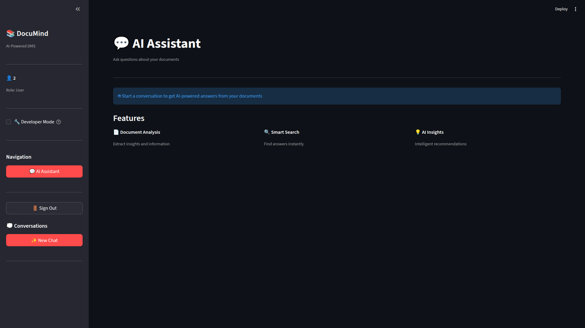
  &nbsp;&nbsp;
  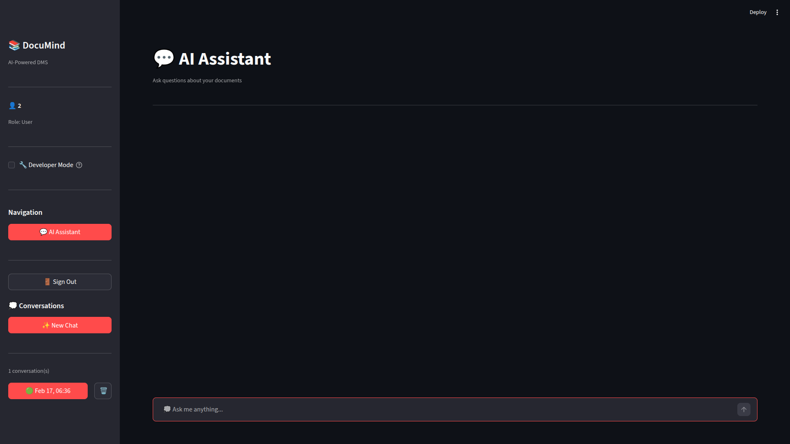
</p>
<p align="center"><em>Creating a Chat Session &nbsp;&nbsp;&nbsp;&nbsp;&nbsp;&nbsp;&nbsp;&nbsp;&nbsp;&nbsp;&nbsp;&nbsp;&nbsp;&nbsp;&nbsp;&nbsp;&nbsp;&nbsp;&nbsp;&nbsp;&nbsp;&nbsp;&nbsp;&nbsp;&nbsp;&nbsp;&nbsp;&nbsp;&nbsp;&nbsp;&nbsp;&nbsp;&nbsp;&nbsp; Chatting on the Session</em></p>

<p align="center">
  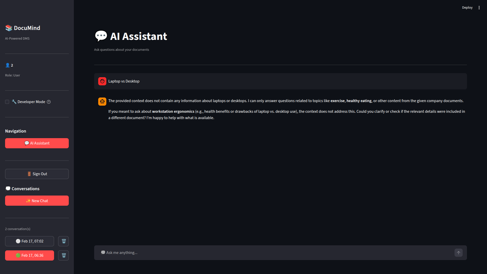
  &nbsp;&nbsp;
  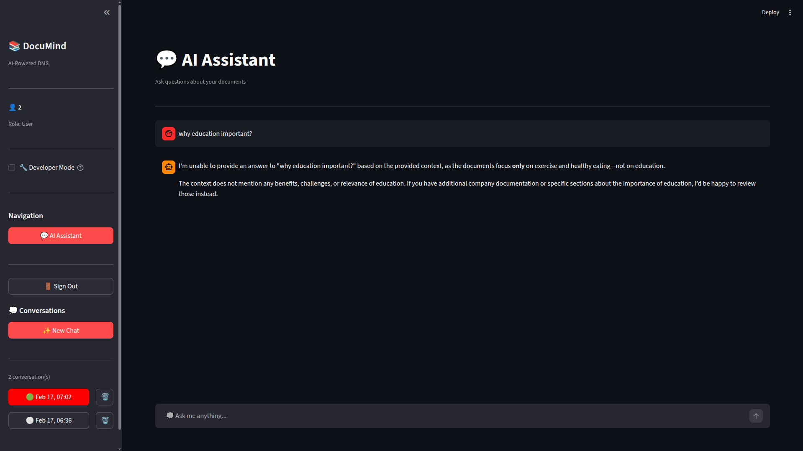
</p>
<p align="center"><em>Chatting with Admin-Only Docs &nbsp;&nbsp;&nbsp;&nbsp;&nbsp;&nbsp;&nbsp;&nbsp;&nbsp;&nbsp;&nbsp;&nbsp;&nbsp;&nbsp;&nbsp;&nbsp;&nbsp;&nbsp;&nbsp;&nbsp;&nbsp;&nbsp;&nbsp;&nbsp;&nbsp;&nbsp; Chatting with Staff & Admin Docs</em></p>

<p align="center">
  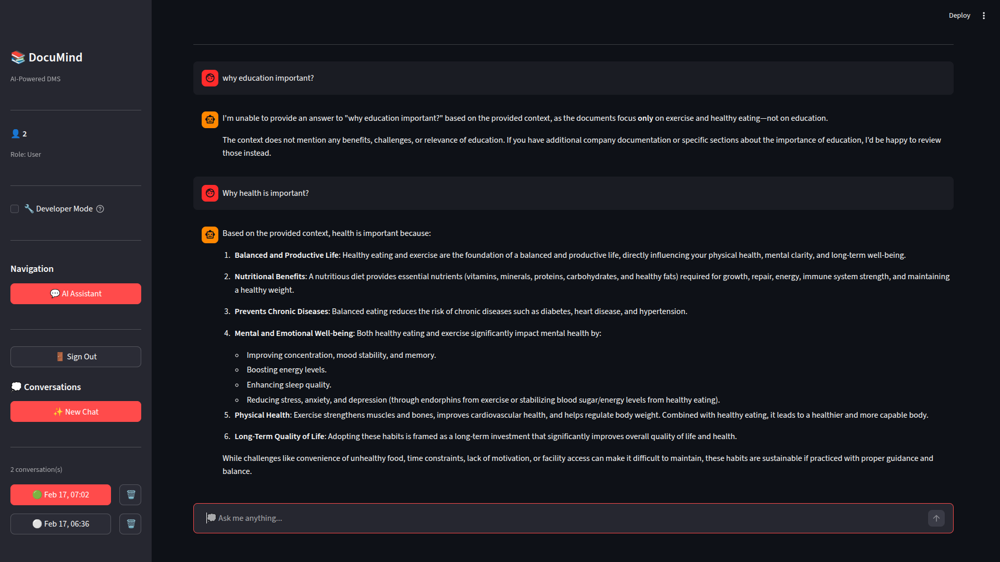
</p>
<p align="center"><em>Chatting with User-Only Docs</em></p>

---

### Staff

<p align="center">
  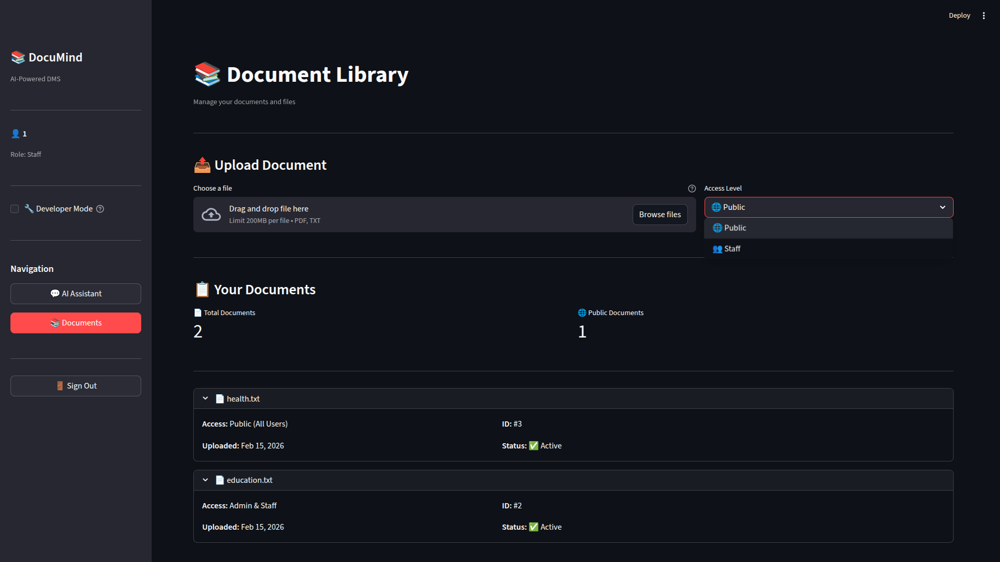
  &nbsp;&nbsp;
  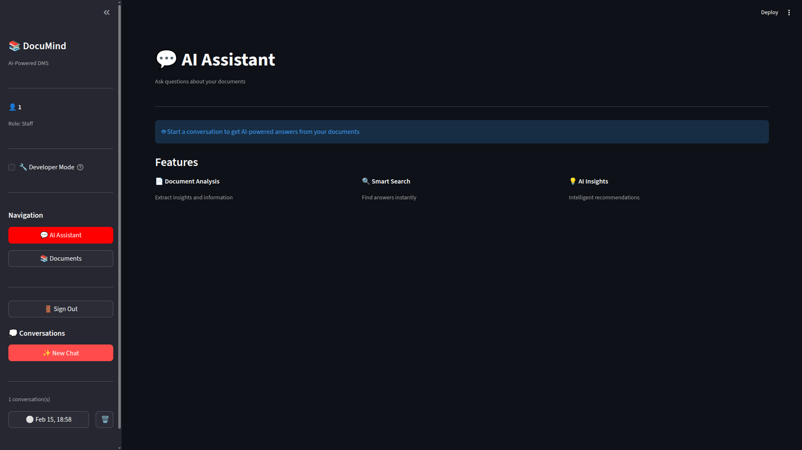
</p>
<p align="center"><em>Staff Document Upload &nbsp;&nbsp;&nbsp;&nbsp;&nbsp;&nbsp;&nbsp;&nbsp;&nbsp;&nbsp;&nbsp;&nbsp;&nbsp;&nbsp;&nbsp;&nbsp;&nbsp;&nbsp;&nbsp;&nbsp;&nbsp;&nbsp;&nbsp;&nbsp;&nbsp;&nbsp;&nbsp;&nbsp;&nbsp;&nbsp;&nbsp;&nbsp;&nbsp;&nbsp;&nbsp;&nbsp;&nbsp;&nbsp; Staff Create Chat</em></p>

<p align="center">
  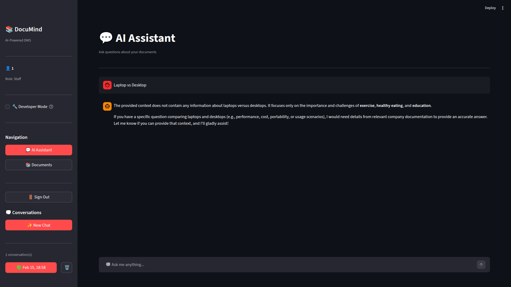
  &nbsp;&nbsp;
  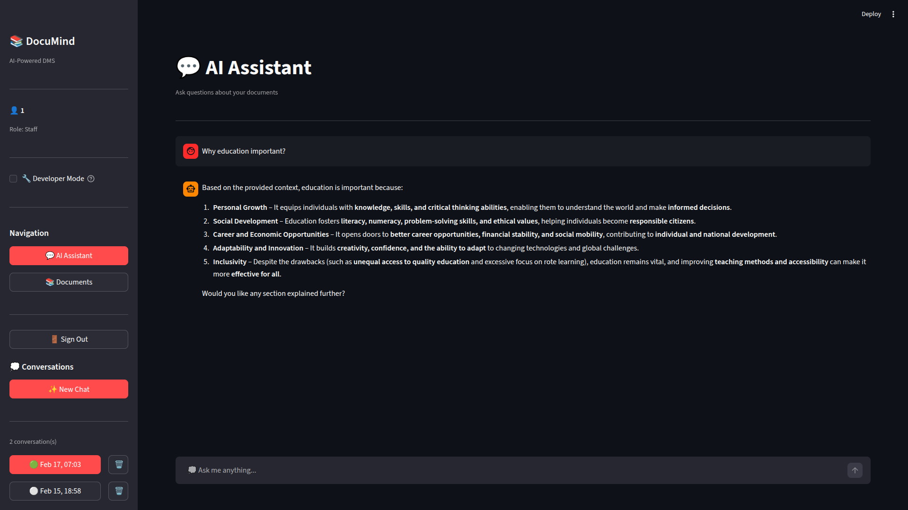
</p>
<p align="center"><em>Chatting with Admin-Only Docs &nbsp;&nbsp;&nbsp;&nbsp;&nbsp;&nbsp;&nbsp;&nbsp;&nbsp;&nbsp;&nbsp;&nbsp;&nbsp;&nbsp;&nbsp;&nbsp;&nbsp;&nbsp;&nbsp;&nbsp;&nbsp;&nbsp;&nbsp;&nbsp;&nbsp;&nbsp; Chatting with Staff & Admin Docs</em></p>

<p align="center">
  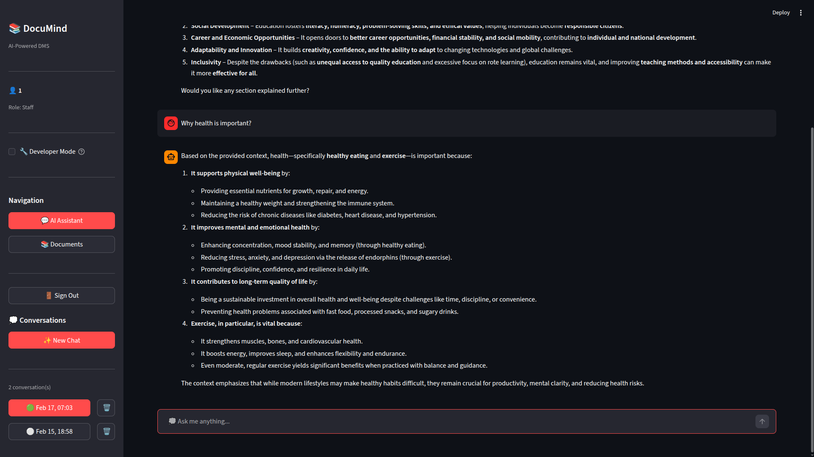
</p>
<p align="center"><em>Chatting with Public Docs</em></p>

---

### Admin

<p align="center">
  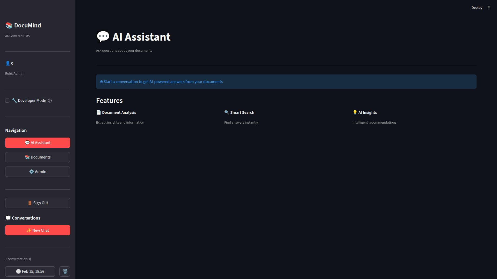
  &nbsp;&nbsp;
  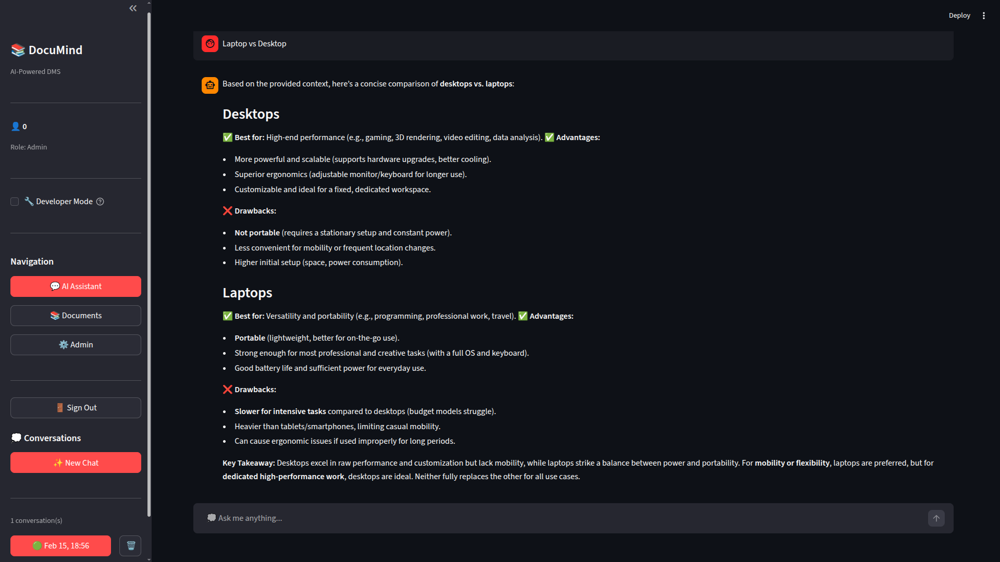
</p>
<p align="center"><em>Admin Own Chat Session &nbsp;&nbsp;&nbsp;&nbsp;&nbsp;&nbsp;&nbsp;&nbsp;&nbsp;&nbsp;&nbsp;&nbsp;&nbsp;&nbsp;&nbsp;&nbsp;&nbsp;&nbsp;&nbsp;&nbsp;&nbsp;&nbsp;&nbsp;&nbsp;&nbsp;&nbsp;&nbsp;&nbsp;&nbsp;&nbsp;&nbsp;&nbsp;&nbsp;&nbsp; Chatting with Admin-Only Docs</em></p>

<p align="center">
  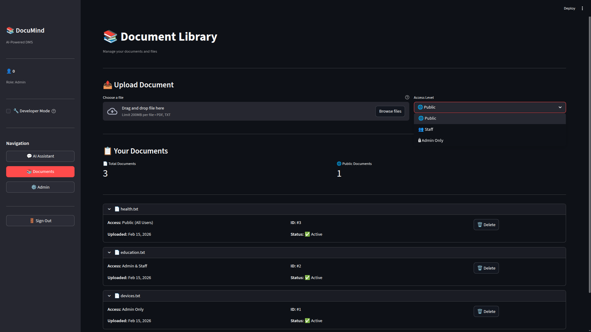
  &nbsp;&nbsp;
  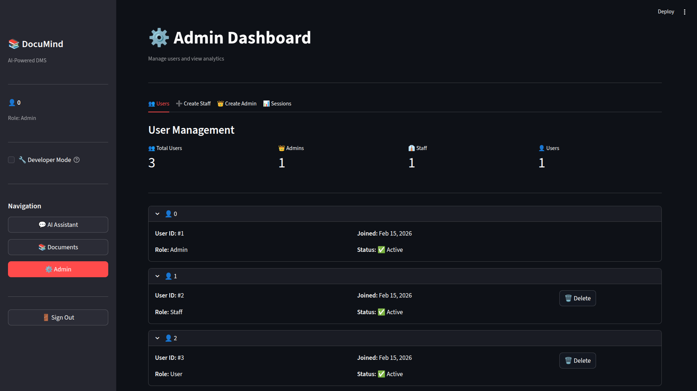
</p>
<p align="center"><em>Admin Document Upload &nbsp;&nbsp;&nbsp;&nbsp;&nbsp;&nbsp;&nbsp;&nbsp;&nbsp;&nbsp;&nbsp;&nbsp;&nbsp;&nbsp;&nbsp;&nbsp;&nbsp;&nbsp;&nbsp;&nbsp;&nbsp;&nbsp;&nbsp;&nbsp;&nbsp;&nbsp;&nbsp;&nbsp;&nbsp;&nbsp;&nbsp;&nbsp;&nbsp;&nbsp;&nbsp;&nbsp; Admin View All Users</em></p>

<p align="center">
  
  &nbsp;&nbsp;
  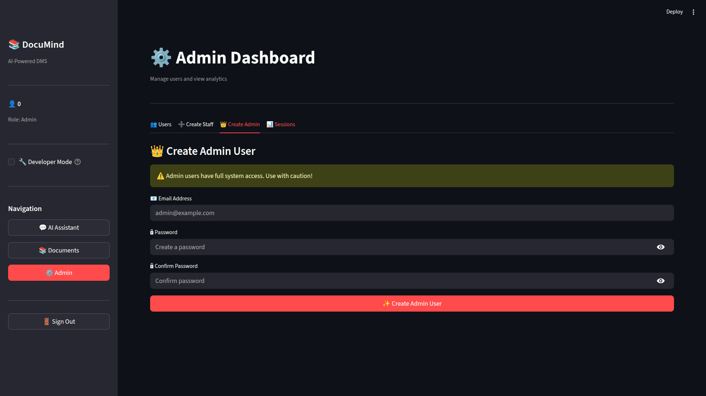
</p>
<p align="center"><em>Admin Create Staff &nbsp;&nbsp;&nbsp;&nbsp;&nbsp;&nbsp;&nbsp;&nbsp;&nbsp;&nbsp;&nbsp;&nbsp;&nbsp;&nbsp;&nbsp;&nbsp;&nbsp;&nbsp;&nbsp;&nbsp;&nbsp;&nbsp;&nbsp;&nbsp;&nbsp;&nbsp;&nbsp;&nbsp;&nbsp;&nbsp;&nbsp;&nbsp;&nbsp;&nbsp;&nbsp;&nbsp;&nbsp;&nbsp;&nbsp;&nbsp;&nbsp;&nbsp; Admin Create Admin</em></p>

<p align="center">
  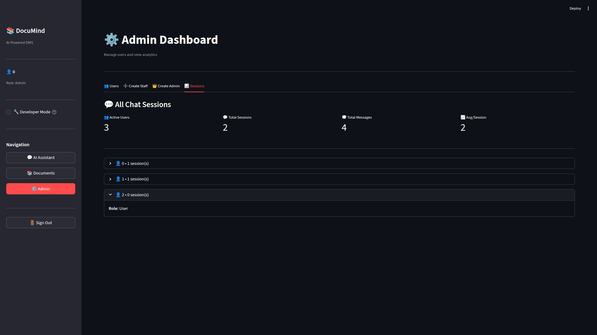
  &nbsp;
  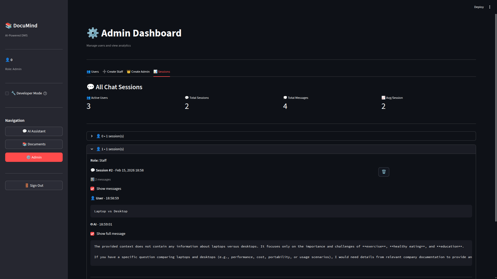
  &nbsp;
  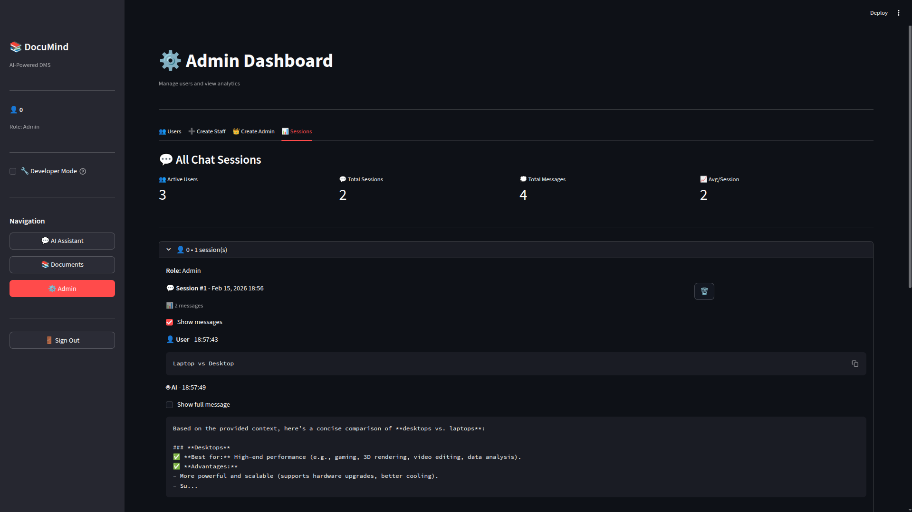
</p>
<p align="center"><em>Admin View All Sessions (1) &nbsp;&nbsp;&nbsp;&nbsp;&nbsp;&nbsp;&nbsp;&nbsp; Admin View All Sessions (2) &nbsp;&nbsp;&nbsp;&nbsp;&nbsp;&nbsp;&nbsp;&nbsp; Admin View All Sessions (3)</em></p>

## Author
Sayan Sarkar Backend & AI Engineer